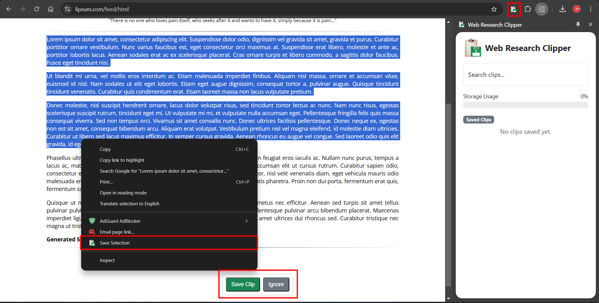

#  Web Research Clipper

A browser extension for students, researchers, and professionals who want to **capture, organise, and cite** information from any website without breaking their workflow.

---

## ✨ Features

- **📌 Highlight & Save** – Right-click or select text to save web content instantly (even on sites that block popups).
- **🧠 Smart Saving** – Use context-aware buttons when highlighting content for faster clipping.
- **🧾 Side Panel Organizer** – View, search, and manage your saved clips from a sleek sidebar.
- **🌐 Works Everywhere** – Built to handle popup-blocking sites gracefully.
- **📚 Research-Ready** – Streamlined for citation workflows in academic and professional research.

---

## 🚀 Getting Started

1. **Install from the Chrome Web Store**  
   → [Add to Chrome](https://chromewebstore.google.com/detail/web-research-clipper/kcjbekkcfhcamkohlffdocmnmjnojmkl)

2. **Install from Microsoft Edge Add-ons**  
   → [Get it on Edge](https://microsoftedge.microsoft.com/addons/detail/web-research-clipper/megmggaappdidanblkheacedkfghicfp?hl=en-GB)

3. Once installed, pin the extension to your toolbar and start highlighting text on any webpage.

---

## 📸 Screenshots

  
   <em>🖱️ Context menu lets users save selected text instantly + 📎 Sidebar view for managing saved research clips</em>

 

  
   📋<em>Saved Clip Overview – Displays clipped content with source, author, and a toolkit of actions like view, cite, copy, and emai</em>
   🔍<em>Full Clip Detail – Expands a saved entry to show full citation data, content body, and export options.</em>
   🔎<em>Search in Action – Demonstrates keyword-based search with dynamic highlighting of terms across saved clips.</em>

---

## 🛠 Tech Stack

- JavaScript (Vanilla + DOM APIs)
- Chrome Manifest v3
- Chrome & Edge Extension APIs
- Local storage & sync APIs

---

## 🎓 Built For

- Students writing essays, dissertations, or thesis work  
- Researchers collecting citations, snippets, or quotes  
- Knowledge workers needing organized, searchable reference material

---

## 🤝 Contributing

Pull requests are welcome! If you’d like to suggest a feature, improve UX, or report a bug:

1. Fork the repo
2. Create your feature branch: `git checkout -b feature/my-feature`
3. Commit your changes: `git commit -m 'Add feature'`
4. Push and open a pull request

Please read [LICENSE.txt](LICENSE.txt) before contributing.

---

## 📄 License

This project is licensed under the [MIT License](LICENSE.txt) — feel free to remix, adapt, and enhance.

---

## 🙌 Acknowledgments

Built with ❤️ by [Chukwuemeka Nwaneri](https://linkedin.com/in/nwanerichukwuemeka) to simplify research for everyone.

---
